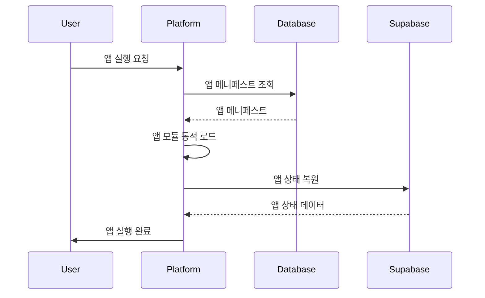
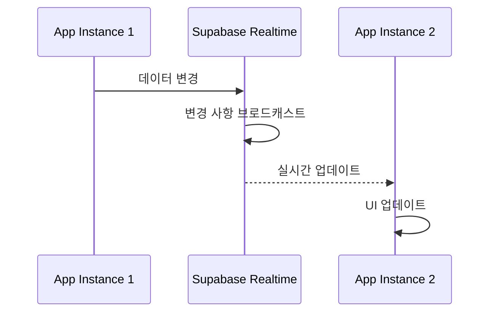

# DOT Platform V0.2 마이크로 앱 플랫폼 베이스 - 기능 명세서

## 프로젝트 개요
- **프로젝트명**: DOT Platform V0.2
- **기능명**: 마이크로 앱 플랫폼 베이스 시스템
- **버전**: 1.0.0
- **작성일**: 2025년 9월 26일
- **작성자**: DOT Platform Team

## 기능 설명
DOT Platform V0.2의 핵심인 마이크로 앱 아키텍처 기반의 플랫폼 베이스 시스템을 구축합니다. 이 시스템은 독립적인 마이크로 앱들(인증, 근태관리, 커뮤니티 등)이 동적으로 로드되고 실행될 수 있는 플랫폼 셸을 제공합니다. Claude Code + GitHub을 통한 개발, Supabase + Vercel을 통한 배포, MCP를 통한 도구 통합을 특징으로 하며, GitHub의 spec-kit을 활용한 명세 기반 개발과 SuperClaude를 통한 지속적 개선을 지원합니다.

## 핵심 목표
1. **확장 가능한 마이크로 앱 플랫폼 구축**: 독립적인 앱들이 동적으로 로드되고 관리될 수 있는 플랫폼 제공
2. **플랫폼 서비스 레이어 구현**: 인증, 라우팅, 상태관리, MCP 통합 등 공통 서비스 제공
3. **개발 워크플로우 통합**: spec-kit을 통한 명세 기반 개발과 SuperClaude를 통한 코드 개선
4. **현대적 배포 인프라**: Supabase + Vercel을 통한 서버리스 배포 환경 구축
5. **MCP 생태계 통합**: 개발 도구들을 MCP를 통해 통합하여 개발 효율성 극대화

## 기술적 요구사항

### 시스템 아키텍처
```
DOT Platform V0.2 (Platform Shell)
├── Core Services Layer
│   ├── Authentication Service (Supabase Auth)
│   ├── Router Service (Dynamic App Routing)
│   ├── State Manager (Isolated App State)
│   └── MCP Bridge (Tool Integration)
├── Micro Apps Layer
│   ├── Auth App (인증/권한 관리)
│   ├── Schedule App (근태관리/스케줄러)
│   ├── Community App (커뮤니티)
│   └── Future Apps (확장 가능)
└── Infrastructure Layer
    ├── Supabase (Database, Auth, Realtime)
    ├── Vercel (Edge Functions, Deployment)
    ├── GitHub (Repository, CI/CD)
    └── MCP Servers (Development Tools)
```

### 기술 스택
- **프론트엔드**: Next.js 14+, React 18+, TypeScript 5+
- **백엔드**: Supabase (PostgreSQL, Auth, Realtime, Edge Functions)
- **배포**: Vercel (Edge Functions, Static Hosting)
- **개발도구**: Claude Code, MCP Servers, GitHub Spec-Kit
- **상태관리**: Zustand (전역), React Context (앱별)
- **라우팅**: Next.js App Router (Dynamic Routes)
- **스타일링**: Tailwind CSS, shadcn/ui components
- **데이터베이스**: PostgreSQL with Row Level Security
- **인증**: Supabase Auth (JWT, OAuth, Social Login)

### 성능 요구사항
- **앱 로딩 시간**: 초기 로드 < 2초, 앱 전환 < 1초
- **API 응답 시간**: 평균 < 500ms, 95% < 1초
- **동시 사용자**: 100+ 동시 사용자 지원
- **메모리 사용량**: 앱당 최대 50MB
- **번들 크기**: 플랫폼 코어 < 500KB, 앱별 < 200KB
- **캐싱 효율성**: 정적 리소스 98% 캐시 히트율

## 상세 기능 명세

### 핵심 기능

#### 1. 플랫폼 셸 (Platform Shell)
- **동적 앱 로딩**: 런타임에 앱 모듈을 동적으로 로드하고 언로드
- **앱 레지스트리**: 설치된 앱들의 메타데이터와 상태 관리
- **앱 생명주기 관리**: 앱의 마운트/언마운트, 상태 보존/복원
- **앱 격리**: 각 앱의 독립적인 실행 환경과 메모리 공간 보장
- **플랫폼 이벤트 시스템**: 앱 간 통신을 위한 이벤트 버스

#### 2. 인증 서비스 (Authentication Service)
- **Supabase Auth 통합**: 이메일/비밀번호, OAuth (Google, GitHub) 인증
- **세션 관리**: JWT 토큰 기반 세션, 자동 갱신, 보안 저장
- **권한 관리**: 역할 기반 접근 제어 (RBAC), 앱별 권한 분리
- **사용자 프로필**: 사용자 정보 관리, 아바타, 설정 저장
- **보안 정책**: 비밀번호 정책, 2FA, 세션 타임아웃

#### 3. 라우터 서비스 (Router Service)
- **동적 라우팅**: 앱 등록/해제에 따른 동적 라우트 생성
- **중첩 라우팅**: 앱 내부의 복잡한 라우팅 구조 지원
- **라우트 가드**: 인증, 권한 확인 기반 접근 제어
- **히스토리 관리**: 앱 간 네비게이션 히스토리 관리
- **딥링킹**: 직접 URL 접근을 통한 앱 내부 페이지 접근

#### 4. 상태 관리 (State Manager)
- **전역 상태**: 사용자 정보, 앱 상태, 플랫폼 설정
- **앱별 격리**: 각 앱의 상태를 독립적으로 관리
- **상태 지속성**: 새로고침 시 상태 복원, 로컬 스토리지 활용
- **상태 동기화**: 실시간 데이터 동기화 (Supabase Realtime)
- **상태 압축**: 메모리 효율성을 위한 상태 압축 및 가비지 수집

#### 5. MCP 브릿지 (MCP Bridge)
- **다중 서버 연결**: Claude Code, Spec-Kit, SuperClaude 등 MCP 서버 관리
- **도구 실행**: MCP 프로토콜을 통한 개발 도구 실행
- **이벤트 중계**: MCP 서버 이벤트를 플랫폼 이벤트 시스템으로 중계
- **설정 관리**: MCP 서버별 설정 및 인증 관리
- **오류 처리**: MCP 서버 연결 실패 시 대체 방안 및 복구 메커니즘

### 사용자 인터페이스

#### 플랫폼 레이아웃
```
┌─────────────────────────────────────────────┐
│ Header (로고, 사용자 메뉴, 알림)                │
├─────────────────────────────────────────────┤
│ Navigation (앱 메뉴, 검색, 설정)               │
├─────────────────────────────────────────────┤
│                                             │
│           App Container                     │
│      (동적으로 로드된 앱 콘텐츠)                │
│                                             │
├─────────────────────────────────────────────┤
│ Footer (상태 표시, 도움말, 버전 정보)            │
└─────────────────────────────────────────────┘
```

#### 주요 UI 컴포넌트
- **App Launcher**: 설치된 앱들을 그리드 형태로 표시
- **App Store**: 새로운 앱 설치 및 업데이트 관리
- **Settings Panel**: 플랫폼 및 앱별 설정 관리
- **Notification Center**: 시스템 및 앱 알림 통합 관리
- **User Profile**: 사용자 정보 및 프로필 관리

#### 반응형 디자인
- **Desktop**: 최소 1200px, 사이드바 네비게이션
- **Tablet**: 768px~1199px, 접이식 네비게이션
- **Mobile**: 최대 767px, 하단 탭 네비게이션
- **다크모드**: 시스템 설정 연동 다크/라이트 모드

### API 설계

#### Platform Core API
```typescript
// 플랫폼 관리 API
GET    /api/platform/info              // 플랫폼 정보
POST   /api/platform/initialize       // 플랫폼 초기화

// 앱 관리 API
GET    /api/apps                      // 설치된 앱 목록
GET    /api/apps/:id                  // 특정 앱 정보
POST   /api/apps/:id/install          // 앱 설치
DELETE /api/apps/:id                  // 앱 삭제
PATCH  /api/apps/:id/update           // 앱 업데이트

// 앱 상태 관리 API
GET    /api/apps/:id/state            // 앱 상태 조회
POST   /api/apps/:id/state            // 앱 상태 저장
DELETE /api/apps/:id/state            // 앱 상태 초기화

// MCP 관리 API
GET    /api/mcp/servers               // MCP 서버 목록
POST   /api/mcp/servers/:id/connect   // MCP 서버 연결
POST   /api/mcp/execute               // MCP 도구 실행
```

#### Authentication API
```typescript
// 인증 API (Supabase Auth 기반)
POST   /auth/signup                   // 회원가입
POST   /auth/signin                   // 로그인
POST   /auth/signout                  // 로그아웃
POST   /auth/refresh                  // 토큰 갱신
GET    /auth/user                     // 사용자 정보
PATCH  /auth/user                     // 사용자 정보 수정

// OAuth API
GET    /auth/oauth/:provider          // OAuth 로그인 (Google, GitHub)
GET    /auth/callback/:provider       // OAuth 콜백 처리
```

## 데이터 모델

### 데이터베이스 스키마

#### 플랫폼 관련 테이블
```sql
-- 플랫폼 설정
CREATE TABLE platforms (
  id UUID PRIMARY KEY DEFAULT uuid_generate_v4(),
  name TEXT NOT NULL,
  version TEXT NOT NULL,
  config JSONB,
  created_at TIMESTAMP DEFAULT NOW(),
  updated_at TIMESTAMP DEFAULT NOW()
);

-- 앱 레지스트리
CREATE TABLE apps (
  id UUID PRIMARY KEY DEFAULT uuid_generate_v4(),
  app_id TEXT UNIQUE NOT NULL,
  name TEXT NOT NULL,
  version TEXT NOT NULL,
  description TEXT,
  manifest JSONB NOT NULL,
  status TEXT DEFAULT 'inactive', -- active, inactive, installing, error
  install_count INTEGER DEFAULT 0,
  created_at TIMESTAMP DEFAULT NOW(),
  updated_at TIMESTAMP DEFAULT NOW()
);

-- 사용자별 앱 설치 정보
CREATE TABLE user_apps (
  id UUID PRIMARY KEY DEFAULT uuid_generate_v4(),
  user_id UUID REFERENCES auth.users(id) ON DELETE CASCADE,
  app_id TEXT REFERENCES apps(app_id) ON DELETE CASCADE,
  installed_at TIMESTAMP DEFAULT NOW(),
  last_used_at TIMESTAMP,
  settings JSONB DEFAULT '{}',
  UNIQUE(user_id, app_id)
);

-- 앱 데이터 저장소 (멀티 테넌트)
CREATE TABLE app_data (
  id UUID PRIMARY KEY DEFAULT uuid_generate_v4(),
  app_id TEXT NOT NULL REFERENCES apps(app_id),
  user_id UUID REFERENCES auth.users(id) ON DELETE CASCADE,
  data_type TEXT NOT NULL, -- state, settings, user_data, cache
  data JSONB NOT NULL,
  expires_at TIMESTAMP, -- 캐시 데이터용
  created_at TIMESTAMP DEFAULT NOW(),
  updated_at TIMESTAMP DEFAULT NOW(),
  INDEX(app_id, user_id, data_type)
);

-- 앱 권한 관리
CREATE TABLE app_permissions (
  id UUID PRIMARY KEY DEFAULT uuid_generate_v4(),
  app_id TEXT NOT NULL REFERENCES apps(app_id),
  user_id UUID REFERENCES auth.users(id) ON DELETE CASCADE,
  permissions TEXT[] NOT NULL,
  granted_by UUID REFERENCES auth.users(id),
  granted_at TIMESTAMP DEFAULT NOW(),
  expires_at TIMESTAMP
);
```

#### 사용자 프로필 확장
```sql
-- 사용자 프로필 확장 (auth.users 테이블 확장)
CREATE TABLE user_profiles (
  id UUID PRIMARY KEY REFERENCES auth.users(id) ON DELETE CASCADE,
  display_name TEXT,
  avatar_url TEXT,
  bio TEXT,
  timezone TEXT DEFAULT 'UTC',
  locale TEXT DEFAULT 'ko-KR',
  theme TEXT DEFAULT 'system', -- light, dark, system
  preferences JSONB DEFAULT '{}',
  created_at TIMESTAMP DEFAULT NOW(),
  updated_at TIMESTAMP DEFAULT NOW()
);
```

### 데이터 플로우

#### 앱 로딩 플로우


#### 실시간 데이터 동기화


## 보안 요구사항

### 인증 및 인가
- **강력한 비밀번호 정책**: 최소 8자, 대소문자/숫자/특수문자 포함
- **다중 인증 지원**: 이메일/비밀번호, Google OAuth, GitHub OAuth
- **세션 보안**: HttpOnly 쿠키, CSRF 보호, XSS 방지
- **권한 기반 접근 제어**: 앱별, 기능별 세분화된 권한 관리
- **자동 세션 만료**: 비활성 시 자동 로그아웃 (30분)

### 데이터 보안
- **Row Level Security (RLS)**: 사용자별 데이터 격리
- **데이터 암호화**: 저장 시 암호화, 전송 시 TLS 1.3
- **민감 정보 보호**: 개인정보 마스킹, 로그 필터링
- **백업 및 복구**: 자동 백업, 암호화된 백업 저장
- **감사 로깅**: 모든 인증 및 권한 변경 사항 로깅

### 앱 보안
- **샌드박스 실행**: 앱별 메모리 격리, DOM 접근 제한
- **CSP (Content Security Policy)**: 인라인 스크립트 차단, 외부 리소스 제한
- **앱 검증**: 디지털 서명 확인, 무결성 검사
- **권한 최소화**: 앱별 필요 최소 권한만 부여
- **보안 업데이트**: 자동 보안 패치 적용

## 배포 및 인프라

### 배포 환경

#### Vercel 배포 구성
```json
{
  "framework": "nextjs",
  "buildCommand": "npm run build",
  "outputDirectory": ".next",
  "functions": {
    "app/api/**/*.ts": {
      "runtime": "nodejs18.x",
      "maxDuration": 10
    }
  },
  "rewrites": [
    {
      "source": "/app/:appId/:path*",
      "destination": "/api/apps/:appId/route?path=:path*"
    }
  ]
}
```

#### Supabase 설정
```javascript
const supabaseConfig = {
  url: process.env.NEXT_PUBLIC_SUPABASE_URL,
  anonKey: process.env.NEXT_PUBLIC_SUPABASE_ANON_KEY,
  auth: {
    autoRefreshToken: true,
    persistSession: true,
    detectSessionInUrl: true
  },
  realtime: {
    channels: {
      'platform': 'public',
      'apps:*': 'authenticated',
      'users:*': 'private'
    }
  }
};
```

### 인프라 구성

#### 환경 구성
- **Development**: 로컬 개발 환경 (Supabase Local, Next.js Dev)
- **Staging**: 테스트 환경 (Supabase Staging, Vercel Preview)
- **Production**: 운영 환경 (Supabase Production, Vercel Production)

#### 모니터링 및 로깅
- **애플리케이션 모니터링**: Vercel Analytics, Supabase Monitoring
- **오류 추적**: Sentry integration
- **성능 모니터링**: Core Web Vitals, User Experience metrics
- **로그 집계**: Structured logging, Error reporting

#### CI/CD 파이프라인
```yaml
# GitHub Actions
name: DOT Platform CI/CD
on:
  push:
    branches: [main, develop]
  pull_request:
    branches: [main]

jobs:
  test:
    runs-on: ubuntu-latest
    steps:
      - name: Test & Lint
        run: |
          npm ci
          npm run test
          npm run lint
          npm run type-check

  deploy:
    needs: test
    if: github.ref == 'refs/heads/main'
    runs-on: ubuntu-latest
    steps:
      - name: Deploy to Vercel
        uses: vercel/action@v2
      - name: Update Supabase
        run: npx supabase db push
```

## 테스트 계획

### 테스트 전략

#### 테스트 피라미드
```
        /\
       /  \    E2E Tests (Playwright)
      /    \   - 사용자 시나리오 테스트
     /      \  - 앱 간 통합 테스트
    /        \
   /          \  Integration Tests (Jest)
  /            \ - API 통합 테스트
 /              \- 데이터베이스 테스트
/______________\ Unit Tests (Jest + Testing Library)
                 - 컴포넌트 테스트
                 - 유틸리티 함수 테스트
```

#### 테스트 범위
- **Unit Tests**: 90% 이상 코드 커버리지
- **Integration Tests**: API 엔드포인트 100% 커버
- **E2E Tests**: 핵심 사용자 시나리오 100% 커버
- **Performance Tests**: 성능 요구사항 검증
- **Security Tests**: 보안 취약점 스캔

### 테스트 케이스

#### 플랫폼 핵심 기능 테스트
```typescript
describe('Platform Shell', () => {
  test('앱 동적 로딩', async () => {
    // 앱 레지스트리에 앱 등록
    // 앱 모듈 동적 로드 확인
    // 앱 인스턴스 생성 확인
  });

  test('앱 간 격리', async () => {
    // 다중 앱 실행
    // 메모리 격리 확인
    // 상태 격리 확인
  });
});

describe('Authentication Service', () => {
  test('이메일 로그인', async () => {
    // 유효한 credentials로 로그인
    // JWT 토큰 발급 확인
    // 세션 저장 확인
  });

  test('OAuth 로그인', async () => {
    // Google OAuth 플로우
    // 사용자 프로필 생성 확인
    // 권한 부여 확인
  });
});
```

#### E2E 테스트 시나리오
```typescript
// Playwright E2E Tests
test('사용자 온보딩 플로우', async ({ page }) => {
  // 1. 플랫폼 접근
  await page.goto('/');

  // 2. 회원가입
  await page.click('[data-testid=signup-button]');
  await page.fill('[name=email]', 'test@example.com');
  await page.fill('[name=password]', 'SecurePass123!');
  await page.click('[type=submit]');

  // 3. 앱 설치
  await page.click('[data-testid=app-store]');
  await page.click('[data-testid=install-auth-app]');

  // 4. 앱 실행
  await page.click('[data-testid=launch-auth-app]');
  await expect(page).toHaveURL('/app/auth/profile');
});
```

## 일정 및 마일스톤

### 개발 단계

#### Phase 1: 플랫폼 코어 구축 (주 1-2)
- **Week 1**: 프로젝트 구조 설정, Next.js + TypeScript 설정
- **Week 2**: 플랫폼 셸 구현, 앱 레지스트리 구현

#### Phase 2: 코어 서비스 구현 (주 3-4)
- **Week 3**: 인증 서비스 (Supabase Auth), 라우터 서비스
- **Week 4**: 상태 관리, MCP 브릿지 구현

#### Phase 3: 첫 번째 마이크로 앱 구현 (주 5-6)
- **Week 5**: Auth 앱 구현, 사용자 프로필 관리
- **Week 6**: 앱 간 통신, 상태 동기화

#### Phase 4: 배포 및 인프라 (주 7-8)
- **Week 7**: Supabase 설정, 데이터베이스 스키마 구축
- **Week 8**: Vercel 배포, CI/CD 파이프라인

#### Phase 5: 테스트 및 최적화 (주 9-10)
- **Week 9**: 포괄적 테스트 작성, 성능 최적화
- **Week 10**: 보안 강화, 문서화 완료

### 주요 마일스톤

#### M1: MVP 플랫폼 (Week 4 완료)
- [ ] 플랫폼 셸 동작
- [ ] 기본 인증 기능
- [ ] 동적 앱 로딩

#### M2: 첫 번째 앱 (Week 6 완료)
- [ ] Auth 앱 완전 구현
- [ ] 앱 간 통신 동작
- [ ] 상태 관리 완료

#### M3: 배포 준비 (Week 8 완료)
- [ ] Supabase 연동 완료
- [ ] Vercel 배포 성공
- [ ] CI/CD 파이프라인 동작

#### M4: 프로덕션 릴리즈 (Week 10 완료)
- [ ] 모든 테스트 통과
- [ ] 보안 요구사항 만족
- [ ] 성능 목표 달성

## 위험 요소 및 대응 방안

### 기술적 위험

#### 높은 위험도
- **앱 격리 실패**: 메모리 누수, 상태 간섭
  - *대응 방안*: 강력한 샌드박싱, 메모리 모니터링
- **성능 저하**: 다중 앱 실행 시 성능 이슈
  - *대응 방안*: 지연 로딩, 메모리 최적화, 성능 프로파일링

#### 중간 위험도
- **MCP 서버 연결 실패**: 개발 도구 통합 문제
  - *대응 방안*: 대체 방안 마련, 오프라인 모드 지원
- **데이터 동기화 이슈**: 실시간 업데이트 충돌
  - *대응 방안*: 충돌 해결 알고리즘, 버전 관리

### 일정 위험
- **개발 지연**: 복잡한 아키텍처로 인한 개발 지연
  - *대응 방안*: MVP 우선, 점진적 기능 추가
- **테스트 시간 부족**: 포괄적 테스트로 인한 시간 부족
  - *대응 방안*: 자동화된 테스트, 병렬 테스트 실행

## 성공 지표

### 기술적 성공 지표
- **플랫폼 안정성**: 99.9% 업타임 달성
- **앱 로딩 성능**: 평균 로딩 시간 < 2초
- **메모리 효율성**: 앱당 메모리 사용량 < 50MB
- **동시 사용자**: 100+ 동시 사용자 지원
- **코드 품질**: 테스트 커버리지 90% 이상

### 사용자 경험 지표
- **사용자 만족도**: 4.5/5.0 이상 평점
- **앱 전환 속도**: 평균 앱 전환 시간 < 1초
- **오류 발생율**: 사용자 세션당 오류 < 0.1%
- **학습 곡선**: 신규 사용자 온보딩 완료율 90%

### 개발 효율성 지표
- **개발 속도**: 새 앱 개발 시간 50% 단축
- **코드 재사용성**: 플랫폼 공통 컴포넌트 활용도 80%
- **배포 빈도**: 주 2회 이상 안정적 배포
- **버그 수정 시간**: 평균 버그 수정 시간 < 4시간

## 추가 고려사항

### 확장성 계획
- **수평 확장**: 더 많은 마이크로 앱 추가 지원
- **수직 확장**: 앱별 복잡한 기능 확장
- **국제화**: 다국어 지원, 지역별 맞춤화
- **접근성**: WCAG 2.1 AA 수준 접근성 지원

### 유지보수성
- **모듈화**: 높은 모듈화로 유지보수 편의성 확보
- **문서화**: 포괄적 API 문서, 개발자 가이드
- **모니터링**: 실시간 시스템 상태 모니터링
- **업데이트**: 무중단 업데이트, 롤백 기능

### 보안 강화
- **정기 보안 감사**: 월 1회 보안 취약점 스캔
- **침입 탐지**: 비정상 접근 패턴 모니터링
- **데이터 보호**: GDPR, 개인정보보호법 준수
- **보안 교육**: 개발팀 보안 교육 정기 실시

### 성능 최적화
- **캐싱 전략**: 다층 캐싱, CDN 활용
- **번들 최적화**: Tree shaking, Code splitting
- **이미지 최적화**: WebP 포맷, 지연 로딩
- **네트워크 최적화**: HTTP/2, 리소스 힌트 활용

---

## 부록

### 참고 문서
- [DOT Platform V0.2 시스템 설계 문서](./SYSTEM_DESIGN.md)
- [DOT Platform V0.2 구현 가이드](./IMPLEMENTATION_GUIDE.md)
- [DOT Platform V0.2 API 문서](./API.md)
- [DOT Platform V0.2 아키텍처 문서](./ARCHITECTURE.md)

### 외부 리소스
- [Supabase Documentation](https://supabase.com/docs)
- [Vercel Documentation](https://vercel.com/docs)
- [Next.js Documentation](https://nextjs.org/docs)
- [MCP Protocol Specification](https://modelcontextprotocol.io)

### 브랜치 및 버전 정보
- **개발 브랜치**: feature/micro-app-platform-base
- **명세서 버전**: 1.0.0
- **생성일**: 2025년 9월 26일
- **마지막 업데이트**: 2025년 9월 26일