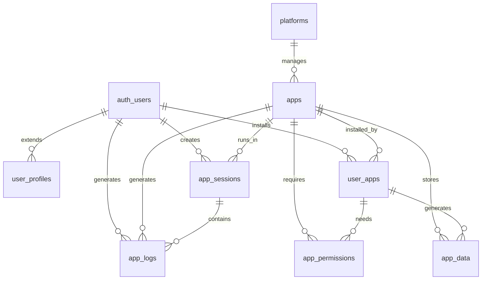

# DOT Platform V0.2 - 데이터 모델 설계

## 데이터베이스 스키마 설계

### 전체 데이터 아키텍처

```
┌─────────────────────────────────────────┐
│            Supabase PostgreSQL          │
├─────────────────┬───────────────────────┤
│  Platform Core  │    Micro Apps Data    │
│     Tables      │       Tables          │
├─────────────────┼───────────────────────┤
│  • platforms    │  • app_data           │
│  • apps         │  • app_permissions    │
│  • user_apps    │  • app_sessions       │
│  • user_profiles│  • app_logs           │
└─────────────────┴───────────────────────┘
```

### 플랫폼 코어 테이블

#### 1. platforms (플랫폼 설정)
```sql
CREATE TABLE platforms (
  id UUID PRIMARY KEY DEFAULT uuid_generate_v4(),
  name TEXT NOT NULL DEFAULT 'DOT Platform V0.2',
  version TEXT NOT NULL,
  config JSONB NOT NULL DEFAULT '{}',
  maintenance_mode BOOLEAN DEFAULT FALSE,
  max_concurrent_apps INTEGER DEFAULT 10,
  max_users_per_app INTEGER DEFAULT 1000,
  created_at TIMESTAMP WITH TIME ZONE DEFAULT NOW(),
  updated_at TIMESTAMP WITH TIME ZONE DEFAULT NOW()
);

-- 플랫폼은 단일 인스턴스이므로 하나의 레코드만 허용
CREATE UNIQUE INDEX idx_platform_singleton ON platforms ((1));

-- 설정 변경 이력 추적을 위한 트리거
CREATE OR REPLACE FUNCTION update_platform_timestamp()
RETURNS TRIGGER AS $$
BEGIN
    NEW.updated_at = NOW();
    RETURN NEW;
END;
$$ LANGUAGE plpgsql;

CREATE TRIGGER platform_update_trigger
    BEFORE UPDATE ON platforms
    FOR EACH ROW EXECUTE FUNCTION update_platform_timestamp();
```

#### 2. apps (앱 레지스트리)
```sql
CREATE TABLE apps (
  id UUID PRIMARY KEY DEFAULT uuid_generate_v4(),
  app_id TEXT UNIQUE NOT NULL, -- 앱의 고유 식별자 (예: 'auth', 'schedule')
  name TEXT NOT NULL, -- 앱 표시명
  display_name_ko TEXT, -- 한글 표시명
  description TEXT,
  description_ko TEXT, -- 한글 설명
  version TEXT NOT NULL DEFAULT '1.0.0',
  manifest JSONB NOT NULL, -- 앱 메니페스트 (라우트, 권한, 의존성 등)

  -- 앱 상태 및 메타데이터
  status TEXT NOT NULL DEFAULT 'inactive' CHECK (status IN ('active', 'inactive', 'installing', 'error', 'deprecated')),
  category TEXT DEFAULT 'utility', -- 앱 카테고리
  tags TEXT[] DEFAULT '{}', -- 검색 및 분류용 태그

  -- 통계 및 메트릭
  install_count INTEGER DEFAULT 0,
  active_users_count INTEGER DEFAULT 0,
  average_rating NUMERIC(3,2) DEFAULT 0.00,
  total_ratings INTEGER DEFAULT 0,

  -- 앱 리소스 제한
  max_memory_mb INTEGER DEFAULT 50,
  max_storage_mb INTEGER DEFAULT 100,
  requires_network BOOLEAN DEFAULT TRUE,

  -- 개발자 정보
  developer_id UUID REFERENCES auth.users(id),
  repository_url TEXT,
  documentation_url TEXT,

  -- 타임스탬프
  created_at TIMESTAMP WITH TIME ZONE DEFAULT NOW(),
  updated_at TIMESTAMP WITH TIME ZONE DEFAULT NOW(),
  published_at TIMESTAMP WITH TIME ZONE,
  deprecated_at TIMESTAMP WITH TIME ZONE
);

-- 인덱스
CREATE INDEX idx_apps_app_id ON apps(app_id);
CREATE INDEX idx_apps_status ON apps(status);
CREATE INDEX idx_apps_category ON apps(category);
CREATE INDEX idx_apps_tags ON apps USING GIN(tags);
CREATE INDEX idx_apps_created_at ON apps(created_at);

-- 앱 매니페스트 JSON 스키마 검증
ALTER TABLE apps ADD CONSTRAINT apps_manifest_check
CHECK (manifest ? 'routes' AND manifest ? 'permissions');
```

#### 3. user_apps (사용자별 앱 설치)
```sql
CREATE TABLE user_apps (
  id UUID PRIMARY KEY DEFAULT uuid_generate_v4(),
  user_id UUID NOT NULL REFERENCES auth.users(id) ON DELETE CASCADE,
  app_id TEXT NOT NULL REFERENCES apps(app_id) ON DELETE CASCADE,

  -- 설치 상태
  status TEXT DEFAULT 'installed' CHECK (status IN ('installed', 'disabled', 'uninstalling')),

  -- 앱별 사용자 설정
  settings JSONB DEFAULT '{}',
  preferences JSONB DEFAULT '{}',

  -- 사용 통계
  launch_count INTEGER DEFAULT 0,
  last_used_at TIMESTAMP WITH TIME ZONE,
  total_usage_minutes INTEGER DEFAULT 0,

  -- 평가
  user_rating INTEGER CHECK (user_rating BETWEEN 1 AND 5),
  user_review TEXT,

  -- 타임스탬프
  installed_at TIMESTAMP WITH TIME ZONE DEFAULT NOW(),
  updated_at TIMESTAMP WITH TIME ZONE DEFAULT NOW(),

  -- 유일성 제약
  UNIQUE(user_id, app_id)
);

-- 인덱스
CREATE INDEX idx_user_apps_user_id ON user_apps(user_id);
CREATE INDEX idx_user_apps_app_id ON user_apps(app_id);
CREATE INDEX idx_user_apps_status ON user_apps(status);
CREATE INDEX idx_user_apps_last_used ON user_apps(last_used_at);
```

#### 4. user_profiles (확장된 사용자 프로필)
```sql
CREATE TABLE user_profiles (
  id UUID PRIMARY KEY REFERENCES auth.users(id) ON DELETE CASCADE,

  -- 기본 프로필 정보
  display_name TEXT,
  avatar_url TEXT,
  bio TEXT,
  website_url TEXT,

  -- 지역화 설정
  timezone TEXT DEFAULT 'Asia/Seoul',
  locale TEXT DEFAULT 'ko-KR',
  date_format TEXT DEFAULT 'YYYY-MM-DD',
  time_format TEXT DEFAULT '24h',

  -- UI/UX 설정
  theme TEXT DEFAULT 'system' CHECK (theme IN ('light', 'dark', 'system')),
  color_scheme TEXT DEFAULT 'default',
  font_size TEXT DEFAULT 'medium' CHECK (font_size IN ('small', 'medium', 'large')),
  reduce_motion BOOLEAN DEFAULT FALSE,

  -- 플랫폼 설정
  default_app_layout TEXT DEFAULT 'grid' CHECK (default_app_layout IN ('grid', 'list')),
  show_app_ratings BOOLEAN DEFAULT TRUE,
  auto_update_apps BOOLEAN DEFAULT TRUE,

  -- 개인화 설정
  preferences JSONB DEFAULT '{}', -- 사용자별 고급 설정
  shortcuts JSONB DEFAULT '{}', -- 키보드 단축키 설정

  -- 개발자 관련 (개발자인 경우)
  is_developer BOOLEAN DEFAULT FALSE,
  developer_verified BOOLEAN DEFAULT FALSE,
  github_username TEXT,

  -- 타임스탬프
  created_at TIMESTAMP WITH TIME ZONE DEFAULT NOW(),
  updated_at TIMESTAMP WITH TIME ZONE DEFAULT NOW(),
  last_seen_at TIMESTAMP WITH TIME ZONE DEFAULT NOW()
);

-- 인덱스
CREATE INDEX idx_user_profiles_display_name ON user_profiles(display_name);
CREATE INDEX idx_user_profiles_is_developer ON user_profiles(is_developer);
CREATE INDEX idx_user_profiles_last_seen ON user_profiles(last_seen_at);
```

### 앱 데이터 테이블

#### 5. app_data (앱별 데이터 저장소)
```sql
CREATE TABLE app_data (
  id UUID PRIMARY KEY DEFAULT uuid_generate_v4(),
  app_id TEXT NOT NULL REFERENCES apps(app_id) ON DELETE CASCADE,
  user_id UUID REFERENCES auth.users(id) ON DELETE CASCADE,

  -- 데이터 분류
  data_type TEXT NOT NULL, -- 'state', 'settings', 'user_data', 'cache', 'temp'
  data_key TEXT NOT NULL, -- 데이터 키 (앱 내에서 고유)

  -- 데이터 내용
  data JSONB NOT NULL,
  data_size INTEGER DEFAULT 0, -- 바이트 단위 크기

  -- 캐시 및 만료 관리
  expires_at TIMESTAMP WITH TIME ZONE, -- 캐시 데이터의 만료 시간
  is_encrypted BOOLEAN DEFAULT FALSE, -- 암호화 여부
  compression_type TEXT, -- 압축 방식 ('gzip', 'lz4' 등)

  -- 버전 관리
  version INTEGER DEFAULT 1,
  previous_version_id UUID REFERENCES app_data(id),

  -- 메타데이터
  metadata JSONB DEFAULT '{}',
  tags TEXT[] DEFAULT '{}',

  -- 타임스탬프
  created_at TIMESTAMP WITH TIME ZONE DEFAULT NOW(),
  updated_at TIMESTAMP WITH TIME ZONE DEFAULT NOW(),
  accessed_at TIMESTAMP WITH TIME ZONE DEFAULT NOW(),

  -- 복합 유일성 제약 (앱당 사용자당 키 유일성)
  UNIQUE(app_id, user_id, data_key)
);

-- 인덱스
CREATE INDEX idx_app_data_app_user ON app_data(app_id, user_id);
CREATE INDEX idx_app_data_type ON app_data(data_type);
CREATE INDEX idx_app_data_expires ON app_data(expires_at) WHERE expires_at IS NOT NULL;
CREATE INDEX idx_app_data_size ON app_data(data_size);
CREATE INDEX idx_app_data_tags ON app_data USING GIN(tags);

-- 만료된 데이터 자동 정리를 위한 함수
CREATE OR REPLACE FUNCTION cleanup_expired_app_data()
RETURNS INTEGER AS $$
DECLARE
    deleted_count INTEGER;
BEGIN
    DELETE FROM app_data
    WHERE expires_at IS NOT NULL AND expires_at < NOW();

    GET DIAGNOSTICS deleted_count = ROW_COUNT;
    RETURN deleted_count;
END;
$$ LANGUAGE plpgsql;

-- 매시간 만료된 데이터 정리 (cron 확장 필요)
-- SELECT cron.schedule('cleanup-expired-data', '0 * * * *', 'SELECT cleanup_expired_app_data();');
```

#### 6. app_permissions (앱 권한 관리)
```sql
CREATE TABLE app_permissions (
  id UUID PRIMARY KEY DEFAULT uuid_generate_v4(),
  app_id TEXT NOT NULL REFERENCES apps(app_id) ON DELETE CASCADE,
  user_id UUID REFERENCES auth.users(id) ON DELETE CASCADE,

  -- 권한 정보
  permissions TEXT[] NOT NULL, -- 권한 배열 ['read:profile', 'write:data', 'admin:users']
  scope TEXT DEFAULT 'user', -- 'user', 'app', 'platform'

  -- 권한 부여 정보
  granted_by UUID REFERENCES auth.users(id), -- 권한을 부여한 사용자
  granted_reason TEXT, -- 권한 부여 사유

  -- 시간 제한
  granted_at TIMESTAMP WITH TIME ZONE DEFAULT NOW(),
  expires_at TIMESTAMP WITH TIME ZONE, -- 권한 만료 시간
  revoked_at TIMESTAMP WITH TIME ZONE, -- 권한 취소 시간

  -- 조건부 권한
  conditions JSONB DEFAULT '{}', -- 권한 적용 조건 (시간, IP, 디바이스 등)

  -- 권한 상태
  status TEXT DEFAULT 'active' CHECK (status IN ('active', 'inactive', 'revoked', 'expired')),

  UNIQUE(app_id, user_id, scope)
);

-- 인덱스
CREATE INDEX idx_app_permissions_app_user ON app_permissions(app_id, user_id);
CREATE INDEX idx_app_permissions_permissions ON app_permissions USING GIN(permissions);
CREATE INDEX idx_app_permissions_status ON app_permissions(status);
CREATE INDEX idx_app_permissions_expires ON app_permissions(expires_at) WHERE expires_at IS NOT NULL;
```

#### 7. app_sessions (앱 세션 관리)
```sql
CREATE TABLE app_sessions (
  id UUID PRIMARY KEY DEFAULT uuid_generate_v4(),
  app_id TEXT NOT NULL REFERENCES apps(app_id) ON DELETE CASCADE,
  user_id UUID NOT NULL REFERENCES auth.users(id) ON DELETE CASCADE,

  -- 세션 정보
  session_token TEXT UNIQUE NOT NULL, -- 앱별 세션 토큰
  device_info JSONB DEFAULT '{}', -- 디바이스 정보 (브라우저, OS 등)
  ip_address INET,
  user_agent TEXT,

  -- 세션 상태
  status TEXT DEFAULT 'active' CHECK (status IN ('active', 'inactive', 'expired', 'terminated')),

  -- 활동 추적
  last_activity_at TIMESTAMP WITH TIME ZONE DEFAULT NOW(),
  activities_count INTEGER DEFAULT 0,
  data_transferred_mb NUMERIC(10,2) DEFAULT 0.00,

  -- 시간 정보
  created_at TIMESTAMP WITH TIME ZONE DEFAULT NOW(),
  expires_at TIMESTAMP WITH TIME ZONE DEFAULT (NOW() + INTERVAL '24 hours'),
  terminated_at TIMESTAMP WITH TIME ZONE
);

-- 인덱스
CREATE INDEX idx_app_sessions_app_user ON app_sessions(app_id, user_id);
CREATE INDEX idx_app_sessions_token ON app_sessions(session_token);
CREATE INDEX idx_app_sessions_status ON app_sessions(status);
CREATE INDEX idx_app_sessions_expires ON app_sessions(expires_at);
CREATE INDEX idx_app_sessions_last_activity ON app_sessions(last_activity_at);
```

#### 8. app_logs (앱 로그 및 모니터링)
```sql
CREATE TABLE app_logs (
  id UUID PRIMARY KEY DEFAULT uuid_generate_v4(),
  app_id TEXT NOT NULL REFERENCES apps(app_id) ON DELETE CASCADE,
  user_id UUID REFERENCES auth.users(id) ON DELETE CASCADE,
  session_id UUID REFERENCES app_sessions(id) ON DELETE CASCADE,

  -- 로그 레벨 및 분류
  level TEXT NOT NULL CHECK (level IN ('DEBUG', 'INFO', 'WARN', 'ERROR', 'FATAL')),
  category TEXT NOT NULL, -- 'auth', 'api', 'ui', 'performance', 'security'
  event_type TEXT NOT NULL, -- 구체적 이벤트 유형

  -- 로그 내용
  message TEXT NOT NULL,
  details JSONB DEFAULT '{}', -- 상세 정보
  stack_trace TEXT, -- 에러 스택 트레이스 (ERROR, FATAL 레벨)

  -- 컨텍스트 정보
  source TEXT, -- 로그 발생 위치 (파일명, 함수명 등)
  request_id TEXT, -- 요청 추적 ID

  -- 성능 메트릭
  duration_ms INTEGER, -- 작업 소요 시간
  memory_usage_mb NUMERIC(10,2), -- 메모리 사용량

  -- 시간 정보
  created_at TIMESTAMP WITH TIME ZONE DEFAULT NOW(),

  -- 파티션 키 (월별 파티셔닝)
  log_date DATE DEFAULT CURRENT_DATE
);

-- 인덱스
CREATE INDEX idx_app_logs_app_level ON app_logs(app_id, level);
CREATE INDEX idx_app_logs_user_time ON app_logs(user_id, created_at);
CREATE INDEX idx_app_logs_category ON app_logs(category);
CREATE INDEX idx_app_logs_level ON app_logs(level);
CREATE INDEX idx_app_logs_date ON app_logs(log_date);

-- 로그 데이터 파티셔닝 (월별)
-- CREATE TABLE app_logs_y2025m01 PARTITION OF app_logs
-- FOR VALUES FROM ('2025-01-01') TO ('2025-02-01');
```

## Row Level Security (RLS) 정책

### 사용자 데이터 보호 정책
```sql
-- 플랫폼 테이블은 읽기 전용 (관리자만 수정)
ALTER TABLE platforms ENABLE ROW LEVEL SECURITY;
CREATE POLICY "Anyone can read platform config" ON platforms FOR SELECT TO public USING (true);
CREATE POLICY "Only platform admins can modify" ON platforms FOR ALL TO authenticated
  USING (auth.jwt() ->> 'role' = 'platform_admin');

-- 앱 레지스트리 접근 정책
ALTER TABLE apps ENABLE ROW LEVEL SECURITY;
CREATE POLICY "Anyone can read active apps" ON apps FOR SELECT TO public
  USING (status IN ('active', 'published'));
CREATE POLICY "Developers can manage their apps" ON apps FOR ALL TO authenticated
  USING (developer_id = auth.uid());

-- 사용자별 앱 설치 데이터
ALTER TABLE user_apps ENABLE ROW LEVEL SECURITY;
CREATE POLICY "Users can manage their own app installations" ON user_apps FOR ALL TO authenticated
  USING (user_id = auth.uid());

-- 사용자 프로필 데이터
ALTER TABLE user_profiles ENABLE ROW LEVEL SECURITY;
CREATE POLICY "Users can read any profile display info" ON user_profiles FOR SELECT TO authenticated
  USING (true);
CREATE POLICY "Users can manage their own profile" ON user_profiles FOR ALL TO authenticated
  USING (id = auth.uid());

-- 앱 데이터 접근 제한
ALTER TABLE app_data ENABLE ROW LEVEL SECURITY;
CREATE POLICY "Users can access their own app data" ON app_data FOR ALL TO authenticated
  USING (user_id = auth.uid());

-- 앱 권한 데이터
ALTER TABLE app_permissions ENABLE ROW LEVEL SECURITY;
CREATE POLICY "Users can view permissions for their installed apps" ON app_permissions FOR SELECT TO authenticated
  USING (user_id = auth.uid() OR app_id IN (
    SELECT app_id FROM user_apps WHERE user_id = auth.uid()
  ));

-- 앱 세션 데이터
ALTER TABLE app_sessions ENABLE ROW LEVEL SECURITY;
CREATE POLICY "Users can access their own sessions" ON app_sessions FOR ALL TO authenticated
  USING (user_id = auth.uid());

-- 앱 로그 접근 (사용자는 자신의 로그만, 개발자는 자신 앱의 로그만)
ALTER TABLE app_logs ENABLE ROW LEVEL SECURITY;
CREATE POLICY "Users can read their own logs" ON app_logs FOR SELECT TO authenticated
  USING (user_id = auth.uid());
CREATE POLICY "Developers can read their app logs" ON app_logs FOR SELECT TO authenticated
  USING (app_id IN (
    SELECT app_id FROM apps WHERE developer_id = auth.uid()
  ));
```

## 데이터 관계 및 참조 무결성

### 핵심 관계 다이어그램


### 데이터 무결성 제약사항
1. **카스케이딩 삭제**: 사용자 삭제 시 관련 데이터 모두 삭제
2. **참조 무결성**: 존재하지 않는 앱이나 사용자 참조 불가
3. **상태 일관성**: 앱 상태와 사용자 설치 상태 동기화
4. **권한 검증**: 앱에서 요구하지 않는 권한 부여 불가

## 성능 최적화 전략

### 인덱싱 전략
1. **복합 인덱스**: 자주 함께 조회되는 컬럼들
2. **GIN 인덱스**: JSONB 및 배열 데이터 검색
3. **부분 인덱스**: 조건부 데이터만 인덱싱
4. **커버링 인덱스**: 조회 전용 인덱스

### 파티셔닝 전략
1. **시간 기반**: 로그 데이터 월별 파티셔닝
2. **해시 파티셔닝**: 대용량 사용자 데이터 분산
3. **범위 파티셔닝**: 앱별 데이터 분리

### 캐싱 전략
1. **애플리케이션 레벨**: 자주 조회되는 앱 메타데이터
2. **쿼리 결과 캐싱**: 복잡한 집계 쿼리 결과
3. **세션 캐싱**: 사용자 세션 및 권한 정보

## 백업 및 복구 전략

### 백업 정책
1. **전체 백업**: 일일 전체 데이터베이스 백업
2. **증분 백업**: 시간별 변경 데이터 백업
3. **포인트-인-타임 복구**: WAL 로그 기반 복구
4. **크로스 리전 복제**: 재해 복구용 원격 복제

### 데이터 보존 정책
1. **로그 데이터**: 3개월 후 압축, 1년 후 아카이빙
2. **세션 데이터**: 30일 후 삭제
3. **캐시 데이터**: 앱별 설정에 따라 자동 만료
4. **삭제된 사용자 데이터**: 즉시 익명화, 30일 후 완전 삭제

---

**문서 정보**
- 작성일: 2025년 9월 26일
- 버전: 1.0.0
- 검토 상태: 설계 완료
- 구현 준비: 준비됨